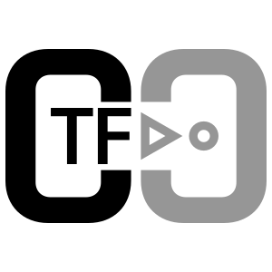

## CTF is a Compact Translation Framework

CTF is a framework for rapid translation definition. Translations are defined with lexical analyzers, translation grammars and output generators.

Lexical analyzers extract tokens from the input. We encourage you to use other C++ tools to do this job, integrating them to CTF should be very easy.
Translation grammars are formal systems that describe translations, where output is defined for each production. See [examples](doc/translation_grammars.md) to learn more. In CTF, translation grammars also describe the relationship between input and output token attributes.
Output generators make semantic checks and transform output tokens to text or binary output.

The API is subject to change in the future slightly to allow a more rigid way to define custom error messages and to provide a solid API for future translation methods.

## Self-building translation units

Tables used during the translation are automatically created from the translation grammars,
speeding up development greatly. This is one of the focuses of this framework.

## Supported translation

* LL table translation

## Future translation methods

* LR table
* bottom-up
* switched LL and bottom-up